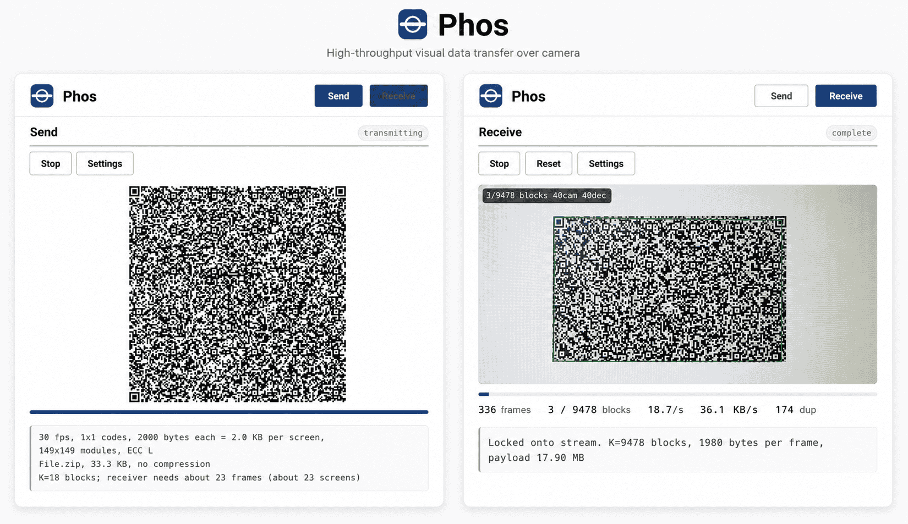

# Phos

  

Send a file between two devices using only a screen and a camera — no network, no pairing, no accounts, no app to install.

**Live page:** https://kaklaber.github.io/Phos/

## How it works

1. Open the page on both devices.
2. The receiving device presses **Receive** and points its camera at the other screen.
3. The sending device presses **Send** and plays the file as an animated stream of QR frames.
4. At 100% the receiver verifies the checksum (SHA-256) and offers the file for download.

The stream is fountain-coded: frames may be missed and the transfer still completes — the sender simply keeps looping until the receiver has enough data.

## Features

- Any file up to 64 MB, or pasted text
- Everything runs locally in the browser — nothing is uploaded, no tracking, works offline once the page is loaded
- A single self-contained HTML file; hostable on any static host
- QR decoding via zxing-cpp compiled to WebAssembly, across multiple worker threads
- Tunable: frame size (180–2900 B), frame rate, 1 / 2×2 / 3×3 code grid, QR error-correction level, display size (incl. fill-screen), camera resolution (480p–4K) and scan rate (up to 60 fps)

## Requirements & notes

- A modern browser (Chrome, Firefox, Safari) on both devices; the receiving device needs a camera.
- The page must be served over **https** (or localhost) — browsers only grant camera access in a secure context.
- Not encrypted. Anyone who can see the sending screen can read the data, so don't use it for secrets in public.

## Built with

- [qrcode-generator](https://github.com/kazuhikoarase/qrcode-generator) — © 2009 Kazuhiko Arase, MIT
- [zxing-wasm](https://github.com/Sec-ant/zxing-wasm) 3.1.2 / [zxing-cpp](https://github.com/zxing-cpp/zxing-cpp) — MIT / Apache-2.0

Third-party copyright notices are retained inside `index.html`.

## License

MIT — see [LICENSE](LICENSE).
